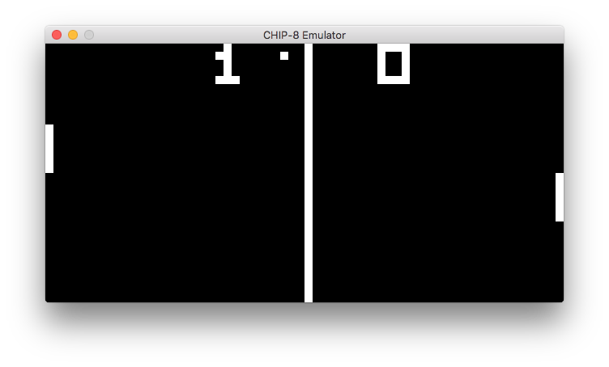
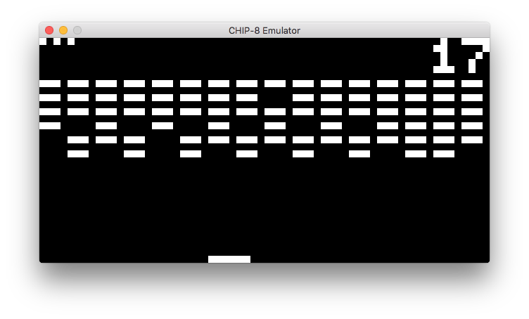
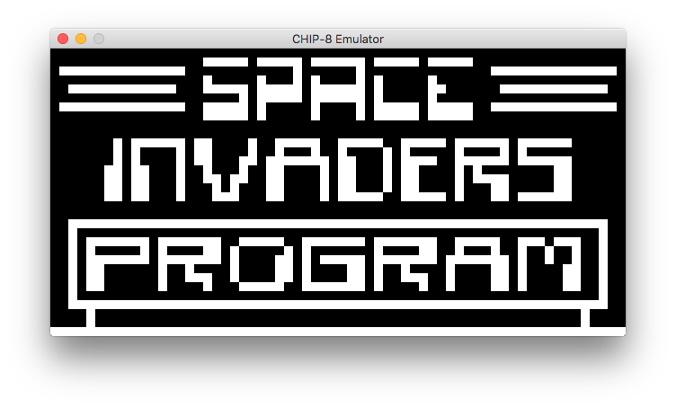

# CHIP-8 [](https://www.gnu.org/licenses/gpl-3.0)
A [CHIP-8](https://en.wikipedia.org/wiki/CHIP-8) emulator written in C++11 using the [SDL2 library](https://www.libsdl.org).

## Building from sources
You will need to have SDL2 headers and libraries installed as well as make utility. Run make to build:
```Shell
$ make
```

## Usage
To emulate chip-8 rom file just pass it as an argument:
```Shell
$ chip8emu /path/to/rom/file/PONG
```

## Screenshots
Pong:



Brix:



Space Invaders:


